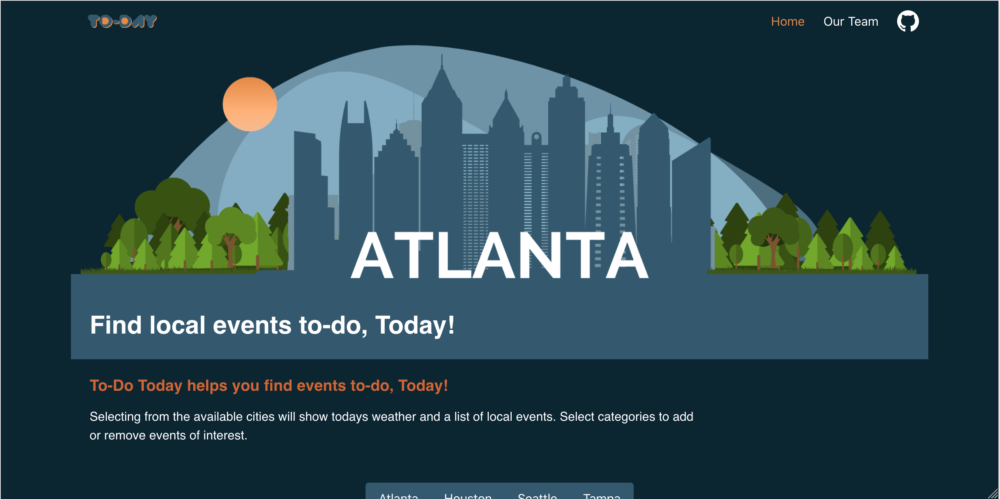

<h1>TO-DO TODAY</h1>


<h2><u>Overview:</u></h2>
<p>To-Do Today provides information about local events that are happening when you use it; Today! With information about weather, concerts, festivals, sporting events, breweries and more, To-Do Today provides plenty of options to find something to-do.</p>
<br>
    
<h2><u>The Team:</u></h2>
<h3>Dylan Cooper: https://github.com/Dcooper15</h3>
<p><b>Primary Team Role:</b> JavaScript</p>
<p><b>Contributions:</b> API Testing</p>
<br>
<h3>Matthew Everett: https://github.com/Mjheverett</h3>
<p><b>Primary Team Role:</b> JavaScript Lead</p>
<p><b>Contributions:</b> API Integrations</p>
<br>
<h3>Justin Gardner: https://github.com/JustinSGardner</h3>
<p><b>Primary Team Role:</b> HTML and CSS</p>
<p><b>Contributions:</b> Testing and UI/UX</p>
<br>
<h3>Harmony Trevena: https://github.com/harmonytrevena</h3>
<p><b>Primary Team Role:</b> HTML, CSS and JavaScript</p>
<p><b>Contributions:</b> UI/UX and Responsive Design</p>
<br>

<h2><u>What We Used:</u></h2>
<h3>Languages:</h3>
<ul>
    <li>HTML5</li>
    <li>CSS</li>
    <li>JavaScript</li>
    <li>JSON</li>
</ul>
<h3>Frameworks:</h3>
<ul>
    <li>Bulma</li>
</ul>
<h3>APIs:</h3>
<ul>
    <li><a href="https://www.openbrewerydb.org/">OpenBreweryDB</a></li>
    <li><a href="https://openweathermap.org/">OpenWeatherMap</a></li>
    <li><a href="https://www.predicthq.com/">PredictHQ</a></li>
    <li><a href="https://developer.ticketmaster.com/">TicketMaster</a></li>
    <li><a href="https://developers.zomato.com/">Zomato</a></li>
</ul>
<br>

<h2><u>MVP (Minimum Viable Product):</u></h2>
<ul>
    <li>Provide Weather and Local Events</li>
    <li>Select from Listed Cities (DigitalCrafts Campus Cities)</li>
    <li>Mobile-first Development</li>
    <li>Category Selections</li>
    <li>Useful and Informative</li>
</ul>
<br>

<h2><u>Stretch Goals Completed:</u></h2>
<ul>
    <li>Clickable Links for Additional Information</li>
    <li>Focused Recommendations</li>
</ul>
<br>
<h2><u>Stretch Goals Future:</u></h2>
<ul>
    <li>Additional Preferences Selections</li>
    <li>Additional Information Displayed</li>
    <ul>
        <li>Images from Location</li>
        <li>Operating Hours</li>
    </ul>
    <li>Additional Cities</li>
</ul>
<br>

<h2><u>Challenges & Solutions:</u></h2>
<h3>Some of the biggest challenges we faced with this project build included:</h2>
<br>
<p><b>Challenge:</b> Display events from a variety of sources and categories in an unbiased manner.</p>
<p><b>Solution:</b> All events are aggreagted by a Promise.All call and combined into a single 'events' array. The array is sorted randomly and then sent to create the HTML elements from the sorted elements.</p>
<br>
<p><b>Challenge:</b> Enable category selection to expand/narrow choices for events types.</p>
<p><b>Solution:</b> Enabling API calls based on the category selection prevents the API from being called if the category is not selected. This both helps to narrow data, but also removed the necessity of adding Filters to the page for the initial product.</p>
<br>
    
<h2><u>Code Snippets:</u></h2>

<h4>Display's the current date and passes that information into the API to return the desired results.</h4>

``` javascript

// Display's Current Date 
    function displayDate() {
        const currentDay = new Date();
            let days = ["Sunday", "Monday", "Tuesday", "Wednesday", "Thursday", "Friday", "Saturday"];
            let day = days[currentDay.getDay()];
        const currentDate = new Date();
            let year = currentDate.getFullYear();
            let date = currentDate.getDate();
            let months = ["January", "February", "March", "April", "May", "June", "July", "August", "September", "October", "November", "December"];
            let month = months[currentDate.getMonth()];
        
          // Use for Month inAPI
        let thisMonth = currentDate.getMonth() + 1;
        
        if (date<10){
            date = "0" + date;
        }
        if (thisMonth<10){
            thisMonth = "0" + thisMonth;
        }
        //Date API url https://api.ipgeolocation.io/timezone?apiKey=9326dc3140ac4b1794c68f9aa51ebdd8&tz=America/Los_Angeles
        const dateToday = document.getElementById('date');
        dateToday.innerHTML = (day +" "+ month +" "+ date +", "+ year);

        // Use for Date and Year in API
        apiDate = String(year + '-' + thisMonth + '-' + date);
        // console.log("apiDate:", apiDate);
        return apiDate;
    };
    displayDate();
    // console.log("apiDate in DOM events", apiDate);

```
<br>
<h4>Showcases how we worked with OpenBreweryDB's API to pull in event data.</h4>

``` javascript

// Craft Beer Data
const getBreweries = (currentCity) => {
    const breweryURL = `https://api.openbrewerydb.org/breweries?by_city=${currentCity}`;
    return get(breweryURL).then(function(breweryData) {
        let breweryList = [];
        let breweryShuffle = [];
        if (categorySelections.includes("breweries")) {
            breweryData.map(function(brewery) {
                const breweryListName = [brewery.name, brewery.website_url];
                breweryShuffle = [...breweryShuffle, breweryListName];
                breweryList = shuffle(breweryShuffle);
                // breweryList = breweryList.slice(0, 5);
                return breweryList;
            })
            // console.log("brewery list array", breweryList);
            return breweryList;
        };
        return breweryList;
    });
};

```
<br>
<h4>Refreshes the search results based on user input.</h4>

``` javascript

// Monitor checkboxes for clicks to update categorySelection variable and trigger refresh of events data for new selection
document.querySelectorAll('#eventSelect').forEach(item => {
    item.addEventListener('click', () => {
        // console.log("item", item.value);
        categorySelection();
        getEventsData(currentCity, apiDate);
    })
});

const categorySelection = () => {
    categorySelections = [];
    const checkboxes = document.querySelectorAll('#eventSelect');
    checkboxes.forEach(item => {
        if (item.checked == true) {
            categorySelections = [...categorySelections, item.value];
        }
        return categorySelections;
    });
    // console.log("category selections", categorySelections);
    return categorySelections;
}

```

<h2>Live Demo</h2>
<a href="https://to-do-today.netlify.app/">To-Do Today</a>
